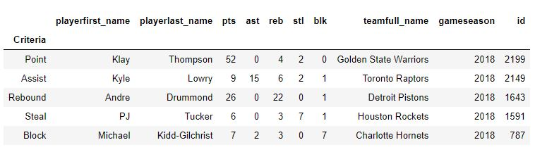
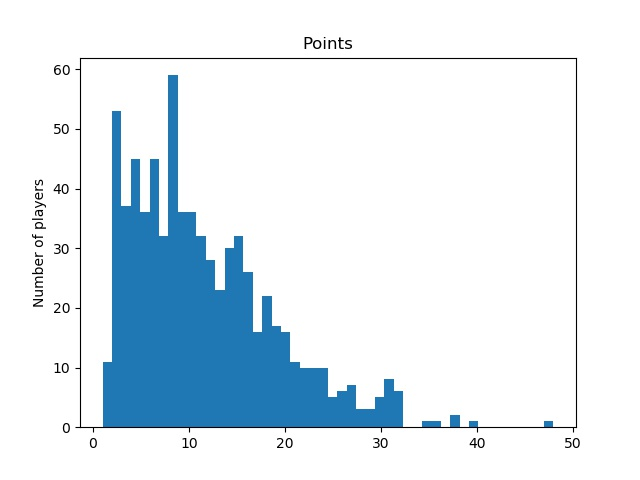

# NBA's top players in the most important abilities 

Authors:  **Seyed Hamed Ghodsi** and **Miti Dilipbhai Patel**

---


## Introduction

- The data we are using in this homework includes the information of games and players in the National Basketball Association (NBA) league. 
- The data source includes 11098 pages, each page 100 rows.There are more than 1 million rows of data which is specific for each player in each game.  

- You can find the data set [Here](https://rapidapi.com/theapiguy/api/free-nba?endpoint=apiendpoint_0c94f219-1d0f-4fc1-8bbb-c5ee6b8327cc)    
- The URL of the data API is: "https://free-nba.p.rapidapi.com/stats"

- It seems that the most updated data belongs to season 2018. There is not updated data set after season 2018. 

---

## Sources

We have used the source code that the website which host the API data, suggested to use. This code is like this:
```
import requests

url = "https://free-nba.p.rapidapi.com/stats"
querystring = {"page":"1","per_page":"100"}

headers = {
    'x-rapidapi-host': "...",  # my own API host
    'x-rapidapi-key': "..."    # my own API key
    }

response = requests.request("GET", url, headers=headers, params=querystring)

print(response.text)
```
The codes retrieves data from [RapidAPI webpage](https://rapidapi.com/theapiguy/api/free-nba?endpoint=apiendpoint_0c94f219-1d0f-4fc1-8bbb-c5ee6b8327cc).
 To retrieve the data, you should select **Python** as your coding language and **Requests** as your preferred package. 

- We also used the concept of flatting dictionary that Dr. Murray taught us in the last lecture of Module5--Online Data. The link to his video is [Here](https://ub.hosted.panopto.com/Panopto/Pages/Viewer.aspx?id=6dec0787-3e8d-4012-ba00-ab8e001eaab7).


---

## Explanation of the Code

1. Our code, `HW7_Seyedham_mitidili.py`, begins by importing necessary Python packages:
```
import json                                # convert the raw data to json 
import requests                            # To retrieve the data from API
import pandas as pd                        # To build the data frame from json data
import matplotlib.pyplot as plt            # To plot 
```

- *Note that maybe packages **requests** and **json** are not installed in your python. To install them you can write these commands in your windows terminal:*

```
pip install json
pip install requests

```
---

2. Then, we retrieve the raw data from [RapidAPI website](https://rapidapi.com/theapiguy/api/free-nba?endpoint=apiendpoint_0c94f219-1d0f-4fc1-8bbb-c5ee6b8327cc) and convert it .json data by implementing the following code:


```
headers = {
    'x-rapidapi-host': "free-nba.p.rapidapi.com",
    'x-rapidapi-key': "215bb899b8mshca9fc34ad929fd9p1883fdjsn411beeb306d0"
    }

url_stats   = "https://free-nba.p.rapidapi.com/stats"
# Reference : https://rapidapi.com/theapiguy/api/free-nba?endpoint=apiendpoint_0c94f219-1d0f-4fc1-8bbb-c5ee6b8327cc

```

- At first, we wrote this code to see how many pages we are dealing with. by running this code, we see that there are more than 11,000 pages of data, and each page has 100 rows of data. since we want to analyze more data to have better conclusion, we thought we may retrieve all, but it is impossible because of the running time. So, we come up to taking the first 50 pages which means that we take 5,000 rows of data. 

```
# To find the number of total pages
querystring = {"page":"1","per_page":"100"}
stats = requests.request("GET", url_stats, headers=headers, params=querystring)
stats_json = stats.json()
#print (len(stats_json['data']))
totalPages = stats_json['meta']['total_pages']
print('There are', totalPages, 'pages of data.')

```

- The problem here is that we can retrieve just one page at the time by using the above code. So to take the first 50 pages, we build a loop in which we retrieve the data for one page, build jason file, then build a data frame using *pandas* package. Then it will repeat for the other pages, and at the end, we append all these data frames to have one single data frame which has 5,000 rows of data. The code of doing these steps is shown here:

```
# To build a dynamic querystring for retrieving data from the original website
totalPages = 50
querystring = dict()
for j in range(1,totalPages+1):
    querystring [j] = {"page":j,"per_page":"100"}

# To build one comprehensive framework which contains all datasets we can retrieve from those 50 (total pages) pages. 
stats_df = pd.DataFrame()
for j in range(1,totalPages+1):
    
    if (j in range(0,totalPages+1,10)):    
        print('page', j , 'is uploading. Maximum page number is:', totalPages)
        
    stats = requests.request("GET", url_stats, headers=headers, params=querystring[j])
    stats_json = stats.json()

    rows1 = []
    for i in range(0,len(stats_json['data'])):
        flatDict = {}

        for key1 in stats_json['data'][i].keys():        
            if (type(stats_json['data'][i][key1]) is dict):           
                for key2 in stats_json['data'][i][key1].keys():               
                    newKey = key1 + key2                
                    flatDict[newKey] = stats_json['data'][i][key1][key2]
            else:
                flatDict[key1] = stats_json['data'][i][key1]

        rows1.append(flatDict)
    
    stats_df = stats_df.append(pd.DataFrame(rows1))
    
```
- going back to the above code, as we said, we also used the concept of flatting a dictionary to have a suitable data frame, which is done by the last **for loop** in the above code.

- There are 46 columns which shows various information include:
first and last name of player, number of points, assist, rebound, steal, and block in each game, team name, game season, game period, game team score, team id, team city, team conference, and so on. 

---

3. Now it is the time to interpret the data.Our main purpose here is to find the top players in each five skill (point, assist, rebound, steal, and block). It means that the output of this section would be a table in which we can see the best player in 5 aspects. We should mention that it happens just in one game, not as an average of their performance in the whole season. 

```
cols = ['playerfirst_name','playerlast_name','pts', 'ast','reb', 'stl','blk','teamfull_name', 'gameseason', 'id']

pts = stats_df [stats_df.pts == stats_df.pts.max()][cols]
pts ['Criteria'] = 'Point'

ast = stats_df [stats_df.ast == stats_df.ast.max()][cols]
ast ['Criteria'] = 'Assist'

reb = stats_df [stats_df.reb == stats_df.reb.max()][cols]
reb ['Criteria'] = 'Rebound'

stl = stats_df [stats_df.stl == stats_df.stl.max()][cols]
stl ['Criteria'] = 'Steal'

blk = stats_df [stats_df.blk == stats_df.blk.max()][cols]
blk ['Criteria'] = 'Block'

# To build the result table
table_df = pts.append(ast).append(reb).append(stl).append(blk)
table_df.set_index('Criteria')

```

- The result shows that for example *James Harden* from *Houston Rockets* could score the highest points in just one game **(48 points)**, or *Russell Westbrook* from *Oklahoma City Thunder* had the most assist in one game **(13 assists)**. The results also show that there are two best players for **Rebound** and 4 best players for **Steal**. 


- We did not know how to save this table as a figure `(.pnj or .jpg)`. So I just took a screen shot and save it manually (HW7_table.jpg). 



---

4. We also did another interpretation. We want to know the distribution of scoring points by number of players. The frequency would be number of players, and bins would be the points in each game. The code is as follow:

```
# To plot the distribution of number of players 

# import matplotlib.pyplot as plt
# %matplotlib inline

df = stats_df [stats_df.pts>=0]['pts']
print('Number of players which their points are recorded:', len(df))

df2 = stats_df [stats_df.pts>0]['pts']
print('Number of players which scored at least one point in a game:', len(df2))

plt.hist(df2, bins=int(stats_df.pts.max()));

plt.gca().set(title='Points', ylabel='Number of players');
plt.savefig('hw7_histogram.jpg')

```
- We save our plot as an image named `hw7_histogram.jpg`, which is shown here:  


- This figure shows that from 722 players which scored at least one point in a game, almost 360 of them scored less than 10 points, while the top player (James Harden) has the highest score with 48 points. It shows the difficulty of his work.  


---

## How to Run the Code

1. Open a terminal window (we use Anaconda terminal).

2. Change directories to where the `.py` file `HW7_Seyedham_mitidili.py` is saved by using this command: `cd C:\Users\.....`

3. Then, type the following command:

```
python HW7_Seyedham_mitidili.py

```
4. When you run the model, you would see some notes. First, it says how many pages we have in the data set (in our case it is 11098 pages). Then, it would say how many pages are uploaded (to inform the user that how long does he/she have to wait to get the result) and what is the total page (in our case we consider 50 pages). At the end, it will save and show the histogram I explained before. 
- you should know that this code cannot save the table as a figure, so the table you can see above, we saved it manually and put it in the GitHub repository. 

---

## Suggestions

Since we retrieved a big data sets including 5,000 rows of data, we can do lots of analysis based on that. As some examples: 

- The average score of a specific player in all games he played.

- Number of players which scored at least one point for a specific team during a time period.   

- The number of blocks have been done in total by a specific team or player in a time period or season.

- A bar plot of total points by each team in a specific NBA season.

